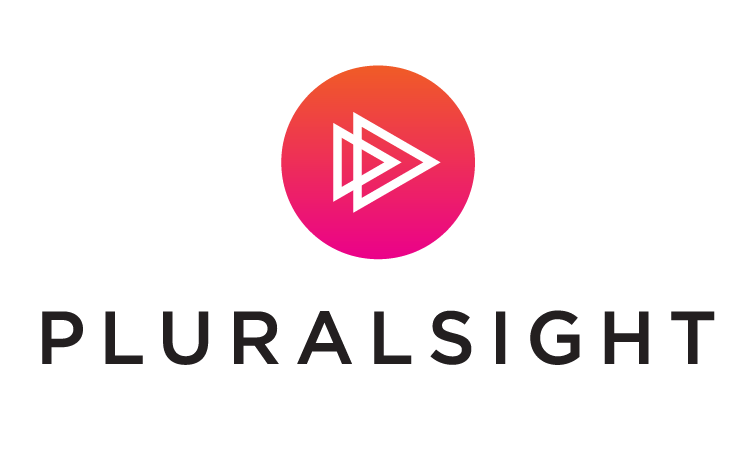

## On this page you can find my programming portfolio starting from my latest creations and going back till my very first applications.

> Projects

### <a href="https://github.com/Kamil-Jankowski/Tic-Tac-Toe-with-AI" target="_blank">Tic-Tac-Toe with AI</a> (project repository) 
### <a href="https://github.com/Kamil-Jankowski/Encryption-Decryption" target="_blank">Encryption-Decryption</a> (project repository)
 

> Learning paths

### [JetBrains Academy: JAVA](jet_brains.md) - _ongoing_:
 
  
 
### [Head First JAVA](head_first_java.md)
 
  

### [Pluralsight JAVA path](pluralsight.md)
  
