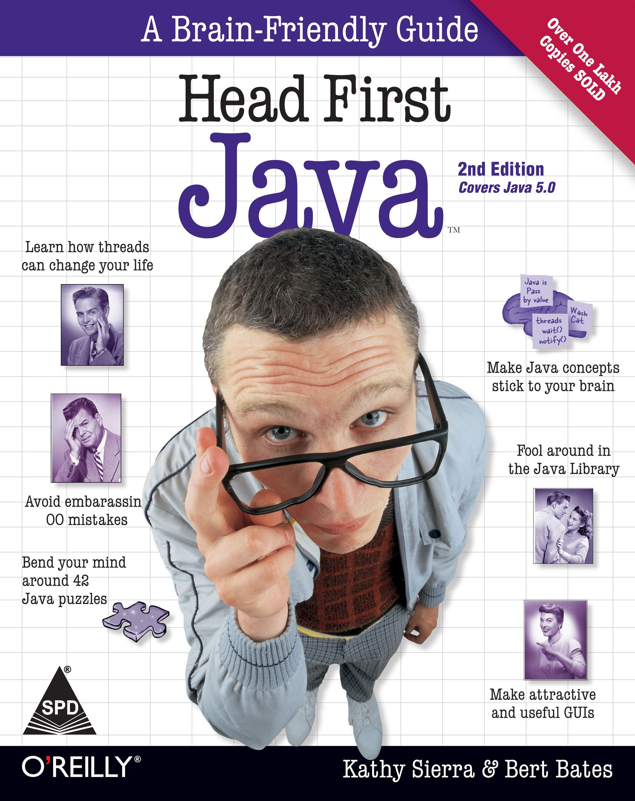

## On this page you can find my programming portfolio starting from my latest creations and going back till my very first applications.

> Projects

### [Encryption-Decryption](https://github.com/Kamil-Jankowski/Encryption-Decryption) (project repository - _ongoing_)
 

> Learning paths

### [JetBrains Academy - JAVA (wiki pages)](jet_brains.md) - _ongoing_:
 
  
 
### [Head First JAVA (wiki pages)](head_first_java.md)
 
  

### [Pluralsight JAVA path (certificates)](pluralsight.md)
  
